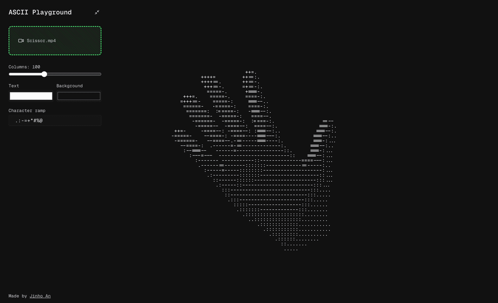

# ASCII Playground

A browser-based tool that converts videos and images into real-time ASCII art. Upload any media file, tweak the settings, and watch it render as characters — all client-side, no server processing.




## Features

- **Video & image support** — drag-and-drop or file picker for any video/image format the browser supports
- **Real-time rendering** — videos play back as ASCII at full frame rate using `requestAnimationFrame`
- **Customizable character ramp** — change which characters map to light/dark values
- **Color controls** — pick text and background colors with live preview
- **Responsive scaling** — ASCII output auto-sizes to fill the viewport
- **Collapsible sidebar** — minimize controls for a cleaner view

## Getting Started

```bash
npm install
npm run dev
```

Open [http://localhost:3000](http://localhost:3000) in your browser.

## Tech Stack

- [Next.js](https://nextjs.org) 16 (App Router)
- [React](https://react.dev) 19
- [TypeScript](https://www.typescriptlang.org) 5
- [Tailwind CSS](https://tailwindcss.com) v4

## How It Works

1. Upload a video or image via the sidebar
2. The file is loaded into a hidden `<video>` or `` element
3. Each frame is drawn to an offscreen `<canvas>`, pixel data is read, and luminance is mapped to characters from the ramp string
4. The resulting ASCII text is rendered in a `<pre>` element that auto-scales to fit the viewport
